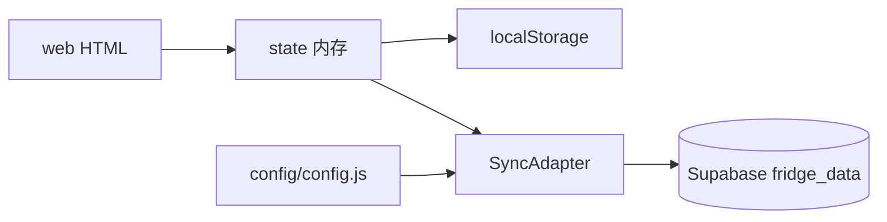

# 架构说明

## 目录结构

```
web/                   # 前端应用（仅 HTML）
  index.html
  fridge-fit-chef.html # 主应用（逻辑 + Open Fridge Glow UI）
  design-demo.html     # 视觉样板（无引擎）
config/                # 运行时配置（Supabase 密钥）
  config.example.js
  config.js            # gitignored
docs/                  # 产品文档
supabase/migrations/   # Postgres schema
scripts/               # 打包、本地服务
tests/smoke.ps1        # 无 Node 冒烟检查
dist/                  # 构建产物（gitignore）
```

## 数据流



## 核心模块

主逻辑在 [`web/fridge-fit-chef.html`](web/fridge-fit-chef.html)：`buildMealPlan`、`buildAdHocMeal`、`SyncAdapter`、食材库与 UI。

配置通过 `<script src="../config/config.js">` 注入 `window.FFC_CONFIG`。

## UI / 主题

视觉系统 **Open Fridge Glow** 以 CSS 变量实现：

- `:root`：`--ink` / `--porcelain` / `--shell` / `--cta` / `--protein` / `--carb` / `--fat` 等
- `html[data-activity=rest|medium|high]`：训练强度主题（底色 + CTA）
- `applyActivityTheme(key)`：写 `data-activity`，并同步 `theme-color`
- 推荐宏量：`macroRingsHtml` + `.macro-rings`（签名组件）

改视觉对齐 [`web/design-demo.html`](../web/design-demo.html)；勿在主题切换里改写推荐算法。

## 分享包

`scripts/make-share-pack.ps1` 将 `web/` + `config/` 打成扁平 zip（HTML 与 config.js 同目录），便于微信发送。
