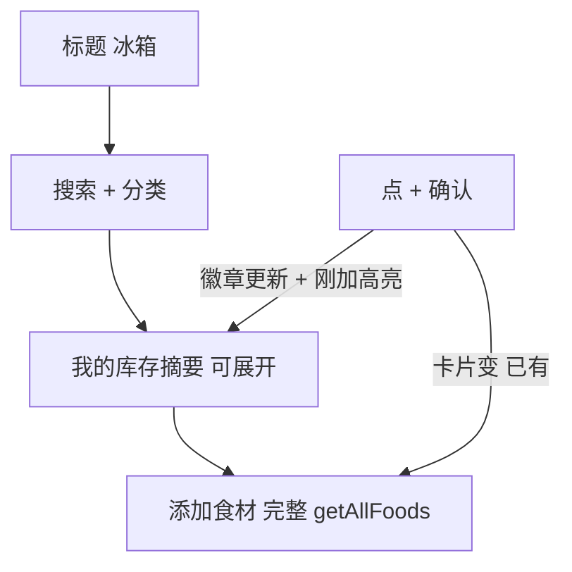

# Fridge 库存 UX 重设计

**日期：** 2026-07-24  
**状态：** 待用户审阅  
**范围：** 仅冰箱 Tab（`#panel-inventory`）；不改推荐引擎 / 同步 / 其他 Tab 主题  
**主文件：** [`web/fridge-fit-chef.html`](../../../web/fridge-fit-chef.html)

---

## 问题

1. **目录不全：** 「常用食材」网格只渲染 `POPULAR_KEYS`（约 10 项）。按「水产」过滤时常只剩虾仁；`FOOD_DB` 中的巴沙鱼柳、三文鱼等不出现。
2. **加入无感弱：** 加入后主要靠短暂 toast，顶部看不到「刚加了什么」。
3. **能加 vs 已有混淆：** 目录与库存同一竖滑流，职责不清。
4. **看库存要下拉：** 库存块在目录下方，打开冰箱页第一眼不是「我有什么」。

---

## 已确认决策

| 项 | 选择 |
|----|------|
| 布局 | **B · 库存置顶**：摘要在上（可展开），完整目录在下 |
| 配色 | **冰蓝霜感**，仅冰箱 Tab |
| 加入反馈 | **A · 顶部库存闪一下**（刚加 chip 高亮 + 徽章更新） |
| 实现路径 | **路径 2**：冰箱页整包；今天 / 菜谱 / 我的保持 Open Fridge Glow |

---

## 信息架构

冰箱页自上而下：

1. 标题「冰箱」
2. 搜索框 + 分类 chips（行为不变：同时过滤摘要与目录）
3. **我的库存**摘要卡（默认折叠）
4. **添加食材**完整目录 +「手动添加」

---

## 行为规格

### 完整目录

- 网格数据源：`getAllFoods()`（`FOOD_DB` + `customFoods`），**不再**仅用 `POPULAR_KEYS`。
- 排序：命中 `POPULAR_KEYS` 的项排在同类前面，其余按原库顺序。
- 仍按 `state.fridgeCat` 与 `state.fridgeSearch` 过滤。
- `NAME_ALIASES` 增加：`巴沙鱼` → `巴沙鱼柳`；搜索对别名与正式名均匹配。
- 分区标题文案：「常用食材」改为「添加食材」。

### 已有 vs 可加

- 若库存中已有同名同单位条目：卡片展示「已有 · N单位」，点击仍打开快捷加量 sheet（数量累加）。
- 否则展示琥珀「+」，点击打开现有 `openQuickAddSheet`。

### 库存摘要与展开

- **折叠：** 数量徽章 = `inventory.length`；最多展示约 6 个 chip（优先当前分类过滤结果），其余用「+N」；操作「展开全部」。
- **展开：** 展示现有分组库存列表（改 / 删），操作改为「收起」。
- 空库存：摘要区显示简短空态文案；目录仍可用。

### 加入反馈（A）

1. `addToInventory` 成功后：`toast('已添加 ' + name)` 保留。
2. 摘要卡加临时 class（约 1.2s）做琥珀描边/微光。
3. 刚加项以 chip 置顶，文案含「刚加」，约 2s 后恢复普通预览顺序。
4. 徽章数字立即反映新库存数量。
5. 目录对应卡片立即变为「已有」态。

### 冰蓝样式（仅冰箱面板）

在 `#panel-inventory`（或 `html` 上冰箱 Tab 时的 scoped 类）覆盖：

| Token 角色 | 约值 |
|------------|------|
| 页背景 | `#E4ECF2` → `#EEF3F7` 竖向渐变 |
| 表面卡 | 近白 / 淡霜蓝边 `rgba(120,170,200,.25)` |
| 选中分类 | 描边 `#4A8BB8`，淡蓝底 |
| CTA / 刚加强调 | 仍用琥珀 `#E8941A` |
| 正文 | 冷墨 `#1A2330`；次要 `#5A7388` |

不修改 `html[data-activity]` 全局主题，也不改其他 panel。

---

## 组件 / 函数改动点

| 区域 | 改动 |
|------|------|
| HTML `#panel-inventory` | 库存块移到目录前；摘要容器 + 展开区；文案「添加食材」 |
| CSS | `#panel-inventory` 冰蓝覆盖；摘要卡、刚加 chip、已有态、脉冲动画 |
| `getPopularFoods` / `renderFridgePage` | 目录改 `getAllFoods` 过滤；渲染已有态；摘要 + 展开 |
| `NAME_ALIASES` / 搜索 | `巴沙鱼` 别名；搜索命中别名 |
| `addToInventory` 调用处 | 触发摘要高亮状态（如 `state.justAdded`） |
| `POPULAR_KEYS` | 用于目录排序（热门项靠前），**不再**作为唯一数据源 |

---

## 非目标

- 今天页「补齐后可做」购物勾选视觉
- 全站换成冰蓝
- 扩充 `FOOD_DB` 新品类（本次只保证库内已有项全部可显示）
- 引擎 / Supabase / localStorage key 变更

---

## 验收标准

1. 水产分类下可见虾仁、三文鱼、巴沙鱼柳（及该分类全部库内项）。
2. 搜索「巴沙鱼」能找到巴沙鱼柳。
3. 进入冰箱 Tab 首屏可见库存摘要，无需先滚过目录。
4. 加入后顶部摘要高亮，刚加 chip 可见，徽章更新，目录卡变「已有」。
5. 今天 / 菜谱 / 我的视觉与改前一致。
6. `tests/smoke.ps1`（或项目既有 smoke）通过。

---

## 测试要点

- 空库存 → 加入第一项 → 摘要与「已有」态
- 已有项再加 → 数量累加 + 刚加反馈
- 分类 / 搜索联过滤摘要与目录
- 展开 / 收起改删后摘要 chip 同步
- 自定义食材出现在目录中
